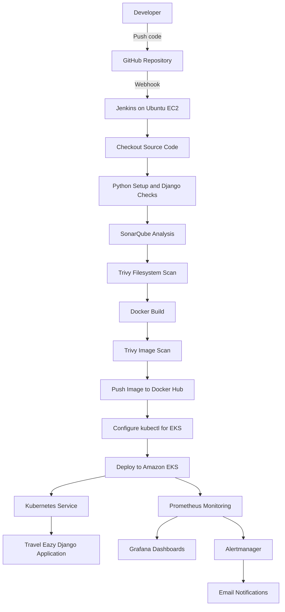

# CI-CD

# Travel Eazy — Cloud-Native CI/CD Deployment & Automation

A cloud-native DevOps project that automates the build, security scanning, containerization, and deployment of the **Travel Eazy** web application to **Amazon EKS** using Jenkins CI/CD. The project also integrates Prometheus, Grafana, and Alertmanager for monitoring and email-based alert notifications.

---

## Table of Contents

* [Project Overview](#project-overview)
* [Project Objectives](#project-objectives)
* [Architecture](#architecture)
* [Technology Stack](#technology-stack)
* [CI/CD Workflow](#cicd-workflow)
* [Project Structure](#project-structure)
* [AWS Infrastructure](#aws-infrastructure)
* [Prerequisites](#prerequisites)
* [Application Configuration](#application-configuration)
* [Docker Setup](#docker-setup)
* [Kubernetes Deployment](#kubernetes-deployment)
* [Jenkins CI/CD Pipeline](#jenkins-cicd-pipeline)
* [Security Scanning](#security-scanning)
* [Monitoring with Prometheus and Grafana](#monitoring-with-prometheus-and-grafana)
* [Alerting with Alertmanager](#alerting-with-alertmanager)
* [Verification and Testing](#verification-and-testing)
* [Troubleshooting](#troubleshooting)
* [Security Considerations](#security-considerations)
* [Cleanup and Cost Management](#cleanup-and-cost-management)
* [Key Learning Outcomes](#key-learning-outcomes)
* [Future Improvements](#future-improvements)

---

## Project Overview

**Travel Eazy** is a web application deployed through an automated DevOps workflow on Amazon Web Services.

The project demonstrates how application code can move from a GitHub repository through an automated CI/CD pipeline and into a Kubernetes environment.

Whenever code is pushed to the configured GitHub repository, a webhook triggers Jenkins. Jenkins checks out the source code, prepares the Python environment, runs Django checks and tests, performs SonarQube analysis and Trivy scans, builds a Docker image, pushes the image to Docker Hub, and deploys the updated application to Amazon EKS.

Prometheus collects monitoring metrics, Grafana provides dashboards, and Alertmanager routes selected application alerts to email.

### Project Highlights

* Automated CI/CD pipeline using Jenkins and GitHub webhooks
* Django application containerized with Docker
* Docker image published to Docker Hub
* Kubernetes deployment on Amazon EKS
* Static code analysis using SonarQube
* Filesystem and container-image vulnerability scanning using Trivy
* Application and Kubernetes monitoring using Prometheus
* Metrics visualization using Grafana
* Email notifications using Alertmanager and Gmail SMTP
* AWS infrastructure access through an EC2 IAM role

---

## Project Objectives

1. Automate application build and deployment.
2. Implement a GitHub-to-Jenkins webhook workflow.
3. Package the application as a Docker image.
4. Deploy and manage the application on Amazon EKS.
5. Integrate code quality and security scanning into CI/CD.
6. Monitor application and Kubernetes resources.
7. Configure alerts for application availability, CPU usage, and pod restarts.
8. Practice cloud-native DevOps tools in an end-to-end project.

---

## Architecture

### High-Level Architecture



### How the Architecture Works

1. The developer pushes application changes to GitHub.
2. GitHub sends a webhook event to Jenkins.
3. Jenkins retrieves the repository source code.
4. Jenkins installs project dependencies and runs Django checks and tests.
5. SonarQube analyzes the configured source directories.
6. Trivy scans the filesystem and the built Docker image.
7. Jenkins builds and pushes a versioned Docker image to Docker Hub.
8. Jenkins configures access to the EKS cluster using AWS CLI and `kubectl`.
9. Kubernetes updates the Travel Eazy Deployment with the new image.
10. Prometheus collects metrics, Grafana visualizes them, and Alertmanager sends configured notifications.

---

## Technology Stack

| Category                           | Technology        |
| ---------------------------------- | ----------------- |
| Cloud Platform                     | AWS               |
| Compute for CI/CD                  | Ubuntu EC2        |
| Container Orchestration            | Amazon EKS        |
| CI/CD                              | Jenkins           |
| Source Control                     | Git, GitHub       |
| Containerization                   | Docker            |
| Container Registry                 | Docker Hub        |
| Infrastructure Access              | AWS CLI, IAM role |
| Kubernetes CLI                     | kubectl           |
| Kubernetes Package Manager         | Helm              |
| Code Quality                       | SonarQube         |
| Vulnerability Scanning             | Trivy             |
| Monitoring                         | Prometheus        |
| Visualization                      | Grafana           |
| Alerting                           | Alertmanager      |
| Application                        | Python, Django    |
| Application Server                 | Gunicorn          |
| Static Files                       | WhiteNoise        |
| Database in current practice setup | SQLite            |

---

## CI/CD Workflow

### Pipeline Stages

| Stage                 | Purpose                                                      |
| --------------------- | ------------------------------------------------------------ |
| Checkout              | Retrieves source code from GitHub                            |
| Python Setup          | Creates a virtual environment and installs dependencies      |
| Django Checks         | Runs Django configuration checks and tests                   |
| SonarQube Analysis    | Performs static source-code analysis                         |
| Trivy Filesystem Scan | Scans project files for selected vulnerabilities and secrets |
| Docker Build          | Builds a versioned Docker image                              |
| Trivy Image Scan      | Scans the built container image                              |
| Docker Hub Push       | Publishes the image to Docker Hub                            |
| Configure EKS         | Configures kubeconfig and verifies cluster access            |
| Deploy to EKS         | Applies Kubernetes manifests and updates the image           |
| Verify Deployment     | Checks deployment, pods, and service status                  |

### Pipeline Trigger

The pipeline is configured to respond to GitHub push events using a webhook.

Example webhook endpoint format:

```text
http://<JENKINS_PUBLIC_IP>:8080/github-webhook/
```

Use your current Jenkins public IP or a stable DNS name. Do not commit credentials or private tokens into the repository.

---

## Project Structure

The repository contains the application source code, deployment configuration, and CI/CD files.

```text
CI-CD/
├── Dockerfile
├── Jenkinsfile
├── README-CICD.md
├── requirements.txt
├── manage.py
├── db.sqlite3
├── app/
├── dataset/
├── project/
├── static/
├── templates/
├── k8s/
│   ├── deployment.yaml
│   └── service.yaml
└── sonar-project.properties
```

> The structure above reflects the project files used during the project setup. Confirm the current repository contents before relying on this as an exhaustive file listing.

### Important Files

| File                       | Purpose                                              |
| -------------------------- | ---------------------------------------------------- |
| `Dockerfile`               | Defines how the application Docker image is built    |
| `Jenkinsfile`              | Defines the automated CI/CD pipeline                 |
| `requirements.txt`         | Lists Python dependencies                            |
| `manage.py`                | Django management entry point                        |
| `k8s/deployment.yaml`      | Defines the Kubernetes application Deployment        |
| `k8s/service.yaml`         | Exposes the application through a Kubernetes Service |
| `sonar-project.properties` | Stores SonarQube project analysis settings           |
| `README-CICD.md`           | Additional project-specific documentation            |

### Manually Created Configuration Files

Some monitoring and alerting YAML files were created directly on the Ubuntu machine using `nano`. These are not necessarily part of the GitHub repository.

Examples include:

* `travel-easy-alerts.yaml` — Prometheus alert rules
* A separate AlertmanagerConfig YAML file — email routing configuration

Keep local operational files and repository files clearly distinguished when documenting or sharing the project.

---

## AWS Infrastructure

### Main AWS Resources

| Resource                        | Purpose                                                                              |
| ------------------------------- | ------------------------------------------------------------------------------------ |
| Ubuntu EC2 instance             | Hosts Jenkins and CI/CD tools                                                        |
| IAM instance role               | Allows Jenkins EC2 to access AWS services without storing long-lived AWS access keys |
| Amazon EKS cluster              | Runs the Kubernetes application and monitoring workloads                             |
| EKS worker nodes                | Provide compute capacity for application and monitoring pods                         |
| Kubernetes LoadBalancer Service | Exposes the Travel Eazy application externally                                       |
| Docker Hub                      | Stores versioned application images                                                  |

### Project Configuration

| Setting              | Value                      |
| -------------------- | -------------------------- |
| AWS Region           | `ap-south-1`               |
| EKS Cluster          | `travel-easy-cluster`      |
| Kubernetes Namespace | `travel-easy`              |
| Docker Hub Image     | `mokeshambati/travel-easy` |
| Jenkins Job          | `Travel-Eazy-CI-CD`        |

These are project configuration values, not credentials.

### Configure EKS Access

Run on a machine with AWS CLI, `kubectl`, and the required AWS permissions:

```bash
aws eks update-kubeconfig \
  --region ap-south-1 \
  --name travel-easy-cluster
```

Verify cluster access:

```bash
kubectl get nodes
kubectl get namespaces
```

In the Jenkins pipeline, the EC2 IAM role is used to obtain AWS permissions. Avoid storing long-lived AWS access keys in Jenkins when an IAM role is available.

---

## Prerequisites

The following tools are required to reproduce the project.

### CI/CD EC2 Instance

* Ubuntu Linux
* Java JDK 21
* Jenkins
* Docker
* Git
* Trivy
* AWS CLI
* kubectl
* Helm
* SonarQube, for example running as a Docker container

### AWS and Kubernetes

* AWS account with permissions to manage or access the required resources
* Amazon EKS cluster and worker nodes
* IAM role with the required EKS and supporting AWS permissions
* Docker Hub account
* GitHub repository
* Kubernetes manifests for the application

### Jenkins Configuration

Configure the following in Jenkins:

* Git and Pipeline plugins
* GitHub integration/webhook support
* Credentials Binding
* Docker-related pipeline support
* SonarQube Scanner integration
* Kubernetes CLI integration, if used by your Jenkins setup
* SonarQube server configuration
* Docker Hub credentials stored in Jenkins Credentials

Use credential IDs in the pipeline instead of hardcoding secrets.

---

## Application Configuration

The Travel Eazy application is a Django project.

The container uses Gunicorn to serve the Django application. The project also uses WhiteNoise for static-file handling.

### Python Dependencies

Install dependencies in a Python environment:

```bash
python3 -m venv .venv
source .venv/bin/activate
python -m pip install --upgrade pip
pip install -r requirements.txt
```

### Django Checks

```bash
python manage.py check
python manage.py test
```

### Database Note

The current practice setup includes SQLite data in the application project. This is suitable for demonstrating the deployment workflow, but it is not a durable production database architecture.

For a production deployment, use a managed database such as Amazon RDS and configure database credentials through a secure secret-management mechanism.

---

## Docker Setup

### Build the Image

From the repository root:

```bash
docker build -t mokeshambati/travel-easy:latest .
```

### Run the Container Locally

```bash
docker run --rm -p 8000:8000 \
  mokeshambati/travel-easy:latest
```

Open the application at:

```text
http://localhost:8000
```

### Push the Image to Docker Hub

Authenticate using a Docker Hub access token:

```bash
docker login
```

Then push the image:

```bash
docker push mokeshambati/travel-easy:latest
```

The Jenkins pipeline uses a build-number tag for versioned images, such as:

```text
mokeshambati/travel-easy:<BUILD_NUMBER>
```

Do not store Docker Hub passwords or access tokens in the repository.

---

## Kubernetes Deployment

The application runs in the `travel-easy` namespace.

### Kubernetes Resources

```text
Namespace: travel-easy
├── Deployment: travel-easy
│   └── Pod
│       └── Container: travel-easy
└── Service: travel-easy-service
```

### Application Traffic Flow

```text
Client
  |
  v
Kubernetes LoadBalancer Service :80
  |
  v
Pod targetPort :8000
  |
  v
Gunicorn
  |
  v
Django Application
```

The Service exposes port `80` and forwards traffic to container port `8000`.

### Apply the Kubernetes Manifests

```bash
kubectl apply -f k8s/deployment.yaml
kubectl apply -f k8s/service.yaml
```

### Check the Deployment

```bash
kubectl get deployments -n travel-easy
kubectl get pods -n travel-easy -o wide
kubectl get services -n travel-easy
```

### Check Rollout Status

```bash
kubectl rollout status deployment/travel-easy \
  -n travel-easy \
  --timeout=5m
```

### View Application Logs

```bash
kubectl logs deployment/travel-easy \
  -n travel-easy
```

The Kubernetes Deployment image is updated by Jenkins as part of the CI/CD workflow.

---

## Jenkins CI/CD Pipeline

The `Jenkinsfile` defines the pipeline stages and automates the deployment process.

### Pipeline Summary

```text
GitHub Push
    |
    v
GitHub Webhook
    |
    v
Jenkins Checkout
    |
    v
Python Setup
    |
    v
Django Checks and Tests
    |
    v
SonarQube Analysis
    |
    v
Trivy Filesystem Scan
    |
    v
Docker Build
    |
    v
Trivy Image Scan
    |
    v
Docker Hub Push
    |
    v
Configure EKS Access
    |
    v
Deploy to EKS
    |
    v
Verify Deployment
```

### Configure GitHub Webhook

In the GitHub repository:

1. Open **Settings**.
2. Open **Webhooks**.
3. Add the Jenkins webhook URL.
4. Select JSON as the content type.
5. Subscribe to push events.
6. Save the webhook.
7. Push a test commit and check the webhook delivery and Jenkins build history.

### Configure Jenkins Credentials

Store sensitive credentials in Jenkins Credentials, for example:

* Docker Hub username and access token
* SonarQube token

Reference credentials by their Jenkins credential IDs in the pipeline. Do not write tokens, passwords, or secret keys directly into the `Jenkinsfile`.

### Jenkins Pipeline Behavior

The pipeline is configured to:

* Trigger on GitHub push events
* Prevent concurrent pipeline runs
* Keep a limited number of historical builds
* Build a Docker image tagged with the Jenkins build number
* Push the image to Docker Hub
* Deploy the image to EKS
* Verify the Kubernetes rollout
* Remove the temporary kubeconfig file after execution

---

## Security Scanning

### SonarQube

SonarQube performs static source-code analysis on the configured application source directories.

The pipeline uses SonarQube to help identify code-quality issues and support maintainability reviews.

### Trivy

Trivy is integrated into two pipeline stages:

1. **Filesystem scan** — scans project files for selected vulnerabilities and secrets.
2. **Image scan** — scans the built Docker image for vulnerabilities.

The current pipeline uses Trivy with `--exit-code 0`, so scan findings are reported but do not automatically fail the build.

> A successful pipeline does not necessarily mean that the image has no vulnerabilities. Review scan output and define an appropriate blocking policy before using this workflow for production.

---

## Monitoring with Prometheus and Grafana

The Kubernetes monitoring stack includes Prometheus, Grafana, Alertmanager, Node Exporter, and kube-state-metrics.

### Monitoring Components

| Component          | Purpose                                 |
| ------------------ | --------------------------------------- |
| Prometheus         | Collects and stores metrics             |
| Grafana            | Displays metrics through dashboards     |
| Alertmanager       | Routes and groups alert notifications   |
| Node Exporter      | Exposes host-level metrics              |
| kube-state-metrics | Exposes Kubernetes object-state metrics |

### Monitoring Namespace

The monitoring stack is installed in the `monitoring` namespace.

Check monitoring pods:

```bash
kubectl get pods -n monitoring
```

Check monitoring services:

```bash
kubectl get services -n monitoring
```

### Access Grafana

Run on a machine with access to the cluster:

```bash
kubectl port-forward \
  -n monitoring \
  svc/monitoring-grafana \
  3000:80
```

Open:

```text
http://localhost:3000
```

Retrieve the Grafana admin password from the Kubernetes Secret rather than storing it in GitHub:

```bash
kubectl get secret monitoring-grafana \
  -n monitoring \
  -o jsonpath="{.data.admin-password}" \
  | base64 --decode
echo
```

### Access Prometheus

```bash
kubectl port-forward \
  -n monitoring \
  svc/monitoring-kube-prometheus-prometheus \
  9090:9090
```

Open:

```text
http://localhost:9090
```

### Example PromQL Queries

Application CPU usage:

```promql
sum(
  rate(
    container_cpu_usage_seconds_total{
      namespace="travel-easy",
      container!="",
      container!="POD"
    }[5m]
  )
)
```

Application memory usage:

```promql
container_memory_working_set_bytes{
  namespace="travel-easy",
  container!="",
  container!="POD"
}
```

Application pod count:

```promql
count(kube_pod_info{namespace="travel-easy"})
```

Application deployment availability:

```promql
kube_deployment_status_replicas_available{
  namespace="travel-easy",
  deployment="travel-easy"
}
```

Container restarts over the last ten minutes:

```promql
increase(
  kube_pod_container_status_restarts_total{
    namespace="travel-easy"
  }[10m]
)
```

### Suggested Grafana Dashboard Panels

* Travel Eazy CPU usage
* Travel Eazy memory usage
* Travel Eazy pod count
* Travel Eazy pod status
* EKS node CPU usage
* EKS node memory usage
* Deployment availability
* Container restart count

---

## Alerting with Alertmanager

Prometheus alert rules are used to detect application conditions. Alertmanager handles notification routing.

### Configured Alert Types

| Alert                     | Purpose                                                     |
| ------------------------- | ----------------------------------------------------------- |
| `TravelEasyPodDown`       | Detects when no Travel Eazy deployment replica is available |
| `TravelEasyHighCPU`       | Detects sustained high application CPU usage                |
| `TravelEasyPodRestarting` | Detects repeated container restarts                         |

### Alert Rule File

The Prometheus alert rules were created in a YAML file named:

```text
travel-easy-alerts.yaml
```

The file was manually created on Ubuntu using `nano` and applied to the cluster.

Example commands:

```bash
nano travel-easy-alerts.yaml
```

Validate and apply:

```bash
kubectl apply --dry-run=client -f travel-easy-alerts.yaml
kubectl apply -f travel-easy-alerts.yaml
```

Check the rule:

```bash
kubectl get prometheusrule -n monitoring
```

### Alertmanager Email Notifications

A separate AlertmanagerConfig YAML was manually created to configure email routing for Travel Eazy alerts.

The SMTP credential is stored in a Kubernetes Secret, not directly in the YAML file or GitHub repository.

Verify the Secret exists:

```bash
kubectl get secret alertmanager-smtp -n travel-easy
```

### Access Alertmanager

```bash
kubectl port-forward \
  -n monitoring \
  svc/monitoring-kube-prometheus-alertmanager \
  9093:9093
```

Open:

```text
http://localhost:9093
```

### Test Application Availability Alert

Scale the application to zero replicas to simulate an unavailable application:

```bash
kubectl scale deployment travel-easy \
  -n travel-easy \
  --replicas=0
```

Restore the application:

```bash
kubectl scale deployment travel-easy \
  -n travel-easy \
  --replicas=1
```

The alert may take time to appear because Prometheus evaluates rules at intervals and the configured alert includes a `for` duration.

### Verify Alertmanager Notifications

Check Alertmanager alerts:

```bash
kubectl exec -n monitoring \
  alertmanager-monitoring-kube-prometheus-alertmanager-0 -- \
  amtool --alertmanager.url=http://localhost:9093 alert query
```

Check email notification metrics:

```bash
kubectl exec -n monitoring \
  alertmanager-monitoring-kube-prometheus-alertmanager-0 -- \
  sh -c 'wget -qO- http://localhost:9093/metrics | grep alertmanager_notifications_total'
```

Notification metrics and the receiving email inbox can be used to verify that email delivery is working.

---

## Verification and Testing

### Verify GitHub and Jenkins

* Confirm the latest code is pushed to GitHub.
* Confirm the webhook delivery succeeds.
* Confirm Jenkins starts a build after a push.
* Review each pipeline stage in the Jenkins console output.

### Verify Docker Hub

* Confirm the expected image repository exists.
* Confirm the Jenkins build-number tag was pushed.
* Confirm the image can be pulled from Docker Hub.

### Verify EKS

```bash
kubectl get nodes
kubectl get deployments -n travel-easy
kubectl get pods -n travel-easy -o wide
kubectl get services -n travel-easy
kubectl rollout status deployment/travel-easy -n travel-easy
```

### Verify Monitoring

```bash
kubectl get pods -n monitoring
kubectl get services -n monitoring
kubectl get prometheusrule -n monitoring
```

Check Prometheus targets in the Prometheus interface and confirm the relevant targets are healthy.

### Verify Alerts

* Confirm the Travel Eazy alert rules are loaded.
* Confirm the application availability alert triggers during a controlled test.
* Confirm Alertmanager receives the alert.
* Confirm the configured email notification arrives.
* Restore the application after testing.

---

## Troubleshooting

### Jenkins Build Does Not Start After GitHub Push

Check:

* The GitHub webhook URL is correct.
* The Jenkins server is reachable from GitHub.
* The webhook subscribes to push events.
* The Jenkins job is configured to use the correct repository and branch.
* The webhook delivery shows a successful response.

### Docker Build Fails

Check:

```bash
docker --version
docker info
docker ps
```

Verify the Dockerfile and `requirements.txt` are present in the repository workspace.

### Jenkins Cannot Access Docker

Verify that the Jenkins user has permission to use Docker and that the Docker service is running.

```bash
sudo systemctl status docker
```

If group membership was changed, restart the relevant service or session as appropriate.

### Jenkins Cannot Access EKS

Check the AWS identity:

```bash
aws sts get-caller-identity
```

Check cluster access:

```bash
aws eks update-kubeconfig \
  --region ap-south-1 \
  --name travel-easy-cluster

kubectl get nodes
```

Verify that the EC2 IAM role and Kubernetes access configuration grant the required permissions.

### Application Pod Is Not Running

```bash
kubectl get pods -n travel-easy
kubectl describe pods -n travel-easy
kubectl logs deployment/travel-easy -n travel-easy
```

Review image availability, application startup output, resource limits, configuration, and Kubernetes events.

### Grafana or Prometheus Is Not Accessible

Check monitoring resources:

```bash
kubectl get pods -n monitoring
kubectl get services -n monitoring
```

Confirm the port-forward command is running and that the local port is not already in use.

### Email Alerts Are Not Received

Check:

* AlertmanagerConfig is applied in the intended namespace.
* The configuration matches the intended alert names.
* The SMTP Secret exists and contains valid credentials.
* Gmail SMTP settings and TLS configuration are correct.
* Alertmanager logs and notification metrics show whether delivery succeeded.

Never print or publish SMTP passwords while troubleshooting.

---

## Security Considerations

This project is a learning and demonstration environment. Before adapting it for production:

* Rotate any credentials that may have been exposed during practice.
* Keep secrets out of GitHub and container images.
* Use Jenkins Credentials for pipeline secrets.
* Use IAM roles instead of long-lived AWS access keys where possible.
* Restrict Jenkins, SonarQube, Grafana, Prometheus, and application access.
* Review Trivy findings and define a policy for blocking critical vulnerabilities.
* Use a durable managed database instead of SQLite baked into an image.
* Configure Kubernetes resource requests, limits, probes, and appropriate rollout strategy.
* Use HTTPS and appropriate network controls for externally accessible services.
* Avoid exposing internal monitoring endpoints publicly.

---

## Cleanup and Cost Management

AWS resources may continue to incur charges while running, even when the application is not being used.

Before cleanup:

1. Push and verify project files in GitHub.
2. Save important screenshots and documentation.
3. Confirm which AWS resources belong to this project.
4. Delete only project resources that are no longer needed.
5. Review AWS Billing after cleanup.

Potential resources to review include:

* Amazon EKS cluster
* EKS worker nodes and associated Auto Scaling resources
* Jenkins EC2 instance
* Load balancers
* NAT Gateways
* Elastic IP addresses
* EBS volumes

Do not delete resources that belong to other projects or workloads.

---

## Key Learning Outcomes

Through this project, I practiced:

* Building an automated CI/CD pipeline using Jenkins
* Configuring GitHub webhooks for automatic builds
* Containerizing a Django application with Docker
* Publishing versioned images to Docker Hub
* Deploying applications to Amazon EKS
* Managing Kubernetes Deployments, Services, namespaces, and rollouts
* Integrating SonarQube and Trivy into CI/CD
* Monitoring Kubernetes workloads with Prometheus
* Building Grafana dashboards using PromQL
* Configuring Prometheus alert rules
* Routing alerts through Alertmanager to email
* Using AWS IAM roles for CI/CD infrastructure access
* Troubleshooting deployment, networking, monitoring, and alerting issues

---

## Future Improvements

Potential next steps include:

* Use Amazon RDS for persistent application data.
* Store application secrets in AWS Secrets Manager or another secure secret-management solution.
* Add readiness and liveness probes.
* Configure resource requests and limits.
* Use rolling updates with multiple replicas for improved availability.
* Add automated application tests and coverage reporting.
* Configure a vulnerability policy that blocks selected high-risk findings.
* Add HTTPS and a custom domain.
* Add infrastructure provisioning through Terraform.
* Improve monitoring dashboards and notification routing.
* Add backup and recovery procedures.

---

## Project Summary

**Travel Eazy — Cloud-Native CI/CD Deployment & Automation** demonstrates an end-to-end DevOps workflow using GitHub, Jenkins, Docker, Docker Hub, Amazon EKS, SonarQube, Trivy, Prometheus, Grafana, and Alertmanager.

The project automates application delivery from source-code changes through container build and Kubernetes deployment, while providing monitoring dashboards and email-based alerting for selected application conditions.

---

**Author:** Mokesh Ambati
**GitHub Repository:** [CI-CD](https://github.com/ambatimokesh/CI-CD)
